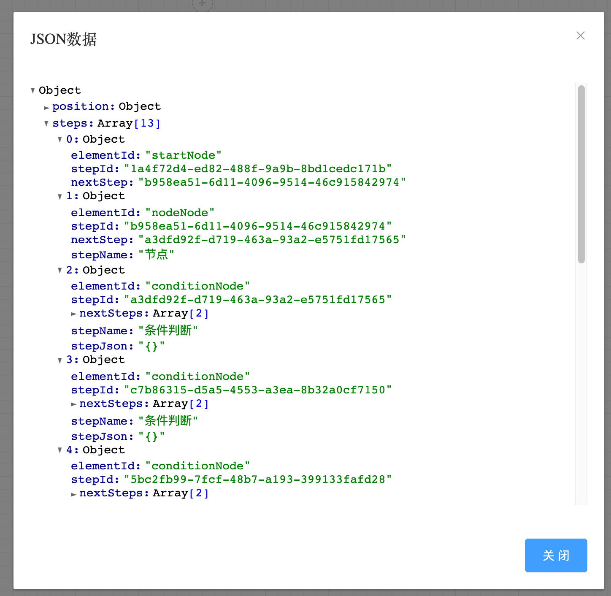

# vue draggable workflow

基于 sortablejs 和 jsplumb.js 实现的 workflow。

- 支持页面布局缩放
- 支持节点
- 支持if else  
- 支持多分支

## 功能

- [ ] 初始化布局
- [x] 自动对齐
- [x] 清空数据
- [x] 获取JSON数据

 
# 部分截图

</img>
</img>
</img>
</img>
