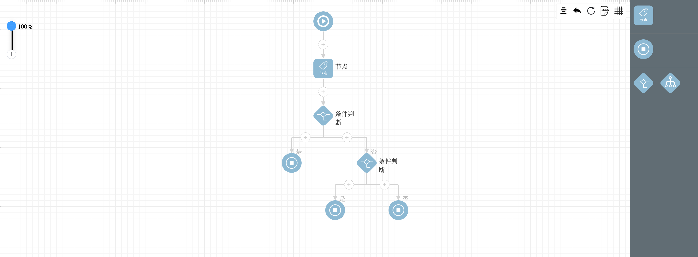

# vue draggable workflow

基于 sortablejs 和 jsplumb.js 实现的 workflow。

- 支持页面布局缩放
- 支持节点
- 支持if else  
- 支持多分支
- 支持节点拖拽


## 功能
- [x] 撤销
- [x] 初始化数据
- [x] 网格线 hide/show
- [x] 边界保护
- [x] 自动排序
- [x] 手动排列
- [x] 清空数据
- [x] 获取JSON数据
- [x] 支持画布拖拽


# 解惑文章

[基于vue和jsplumb的工作流编辑器开发](https://juejin.cn/post/6844904144264773639)

[基于vue和jsplumb的工作流编辑器开发(二)](https://juejin.cn/post/6948313872503832612)


# 执行


> 依赖 yarn 或者 npm

## step1 安装依赖

```
yarn install
```
## step2 开发调试

```
yarn run dev
```

## step3 编译部署

```
yarn run build
```

 
# 部分截图

</img>

</img>

</img>

</img>

</img>


